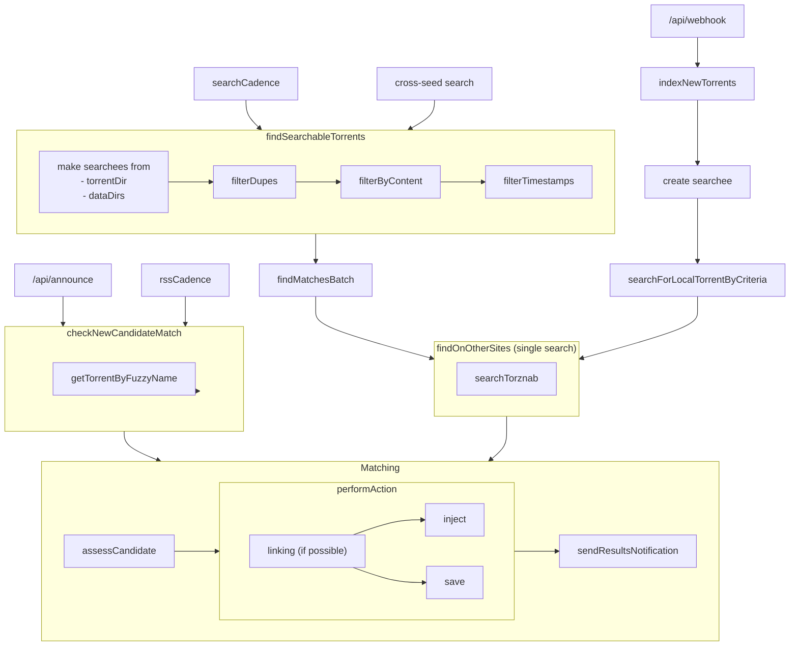

# Architecture

## Pipelines

### Search pipeline

#### Entry points

-   `cross-seed daemon --searchCadence <cadence>`
-   `cross-seed search`
-   `POST /api/search`

The search pipeline takes an owned torrent, parses its name, and then searches for
its parsed name on all of your Torznab indexers. After that, it's given a list
of candidates which then all run through the [**matching algorithm**](#matching-algorithm)
against the owned torrent. Any resulting matches will then run through the configured
[**action**](#actions).

### RSS pipeline

#### Entry points

-   `cross-seed daemon --rssCadence <cadence>`
-   `POST /api/announce`

The RSS pipeline takes a candidate torrent's metadata `{ name, size }` and
searches through your local torrent collection to see if any existing torrents
have the same name. If found, it will run the pair of torrents through the
[**matching algorithm**](#matching-algorithm). If it is found to be a match, it will then
run through the configured [**action**](#actions).

## Prefiltering

Prefiltering occurs during each startup of `cross-seed`. `cross-seed` will index all of the .torrent files from
[`torrentDir`](../basics/options.md#torrentdir) and any data from all configured [`dataDirs`](../basics/options.md#datadirs).

-   If you're using [injection](../tutorials/injection.md), the existence of any .torrent files implies their
    presence in the client. If the torrent is not present in your client, it will fail injection and save instead.

-   Your [`torrentDir`](../basics/options.md#torrentdir) should not contain torrent files that are not present in your client.

-   Prefiltering de-duplicates files (data) and torrents with the same name and will therefore not be searched multiple times.
    :::info
    .torrent files from your [`torrentDir`](../basics/options.md#torrentdir) will take precedence over files in your [`dataDirs`](../basics/options.md#datadirs) with the same name.
    :::

## Matching algorithm

TODO

## Actions

Three things can happen during the `action` phase:

-   link files (if data-based in v5, or not using `v5Linking` in v6)
-   inject matching torrent file
-   save matching torrent file
